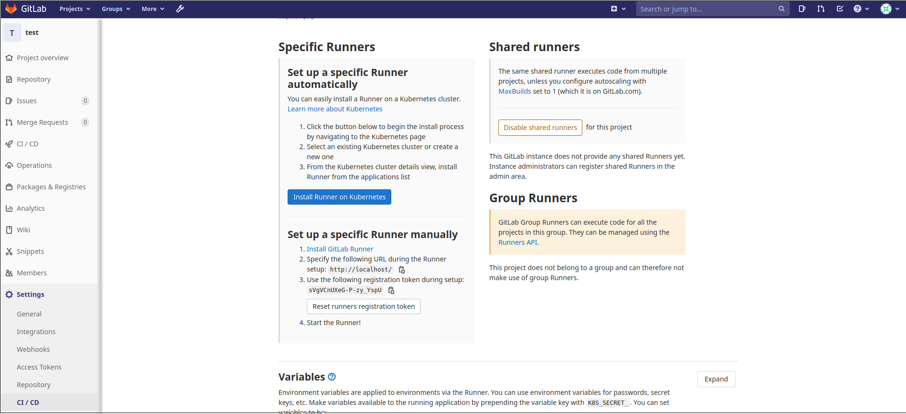
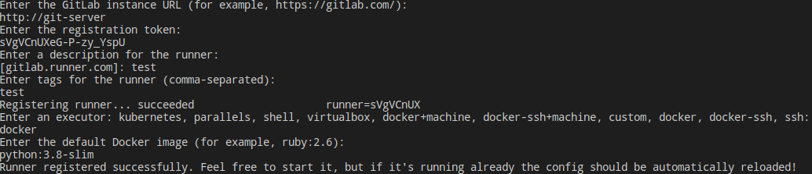
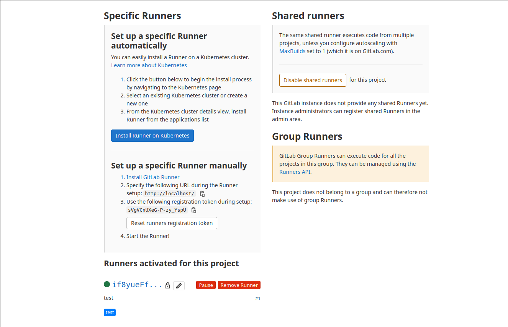
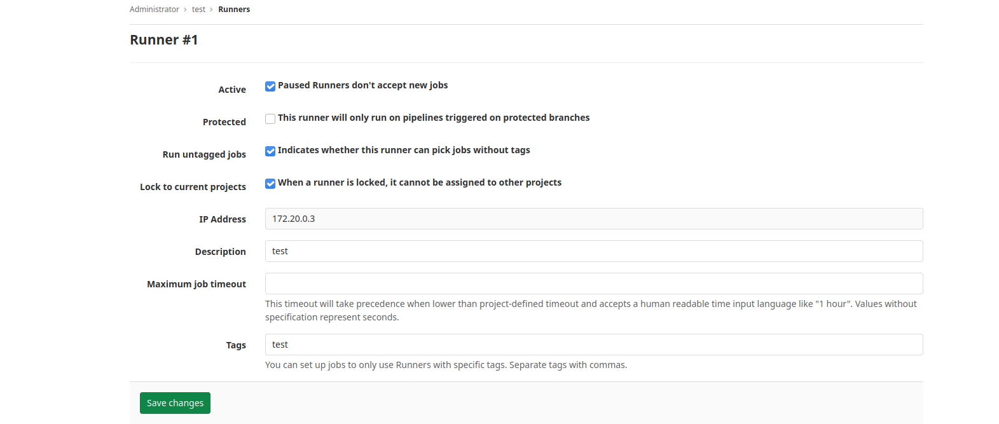

# CI/CD Gitlab Runner

Configuración Docker para despliegue de servidor **Gitlab** e integración continua mediante **Gitlab-Runner**.

### Ejecución

Para iniciar los servicios ejecutamos `docker-compose -p gitlab up -d`. Gitlab disponible con usuario `root` en `localhost:80`.

### Configuración CI

Lo que viene a continuación es registrar un proyecto en gitlab. En este caso se va a crear un proyecto para análisis de código seguro y de calidad. La estructura del proyecto gitlab se encuentra en el directorio `repo`. 

1. En la configuración del proyecto se selecciona la parte de *CI-CD/Runners* para obtener la url y el token del proyecto.

---

---

2. Con dichos datos ejecutamos la siguiente instrucción para registrar el *runner*

~~~
$ docker exec -ti git-runner gitlab-runner register
~~~

3. Conectamos el runner seleccionando como *executor* docker

---

---

Se mustra una imagen de la configuración del runner que indica que el runner y gitlab se encuentran conectados

---

---

4. Debemos añadir la ip del contenedor `git-server` al fichero `/etc/gitlab-runner/config.toml`. En particular se añaden los valores `extra_hosts` y `network_mode` incluidos en el fichero `docker-compose.yml`

*NOTA*: el valor de `network_mode` incluye el nombre del proyecto docker compose. Esto es debido a que docker compose hace el tracking de la configuración de los contenedores mediante dicho parámetro.

~~~
[runners.docker]
    tls_verify = false
    image = "python:3.8-slim"
    privileged = false
    disable_entrypoint_overwrite = false
    oom_kill_disable = false
    disable_cache = false
    volumes = ["/cache"]
    extra_hosts = ["git-server:172.20.0.2"]
    network_mode = "gitlab_git-net"
    shm_size = 0
~~~

5. El archivo `.gitlab-ci.yml` no contiene ningún `tag` (menos aún alguna referencia al tag con que hemos registrado el runner), por lo tanto debemos llevar a cabo una de las siguientes acciones

    - Añadir el `tag` correspondiente (con que hemos registrado el runner) al archivo `.gitlab-ci.yml`.
    - Cambiar la configuración del runner para que pueda ejecutar jobs sin tags

---

---

## Análisis de código

### Linters & Análisis Estático

Python soporta a manera de documentación la definición de tipos de la salida de una función y sus argumentos, se tiene ahora herramientas que verifican el tipado estático.

#### mypy

Es un verificador de tipo estático opcional para Python que tiene como objetivo combinar los beneficios de la escritura dinámica (o "duck") y la escritura estática.

*NOTA*: para solucionar el error `app/app.py:1: error: Skipping analyzing 'numpy': found module but no type hints or library stubs` debemos añadir la correspondiente línea tal como `import numpy as np  # type: ignore`.

#### flake8

Permite comprobar que el código cumple con el PEP-8 de Python.

#### pep8-naming

Adicional a flake8 se puede usar pep8-naming para cumplir con las normas de definición de nombres de PEP-8. Se ejecuta con el mismo comando de flake8.

#### pycodestyle

Es otra herramienta de validación del PEP-8.

#### pylint

Verifica el cumplimiento del PEP-8.

### Formateador de código

#### isort

Permite reformatear el código para que cumpla una serie de estándares. Reordena los imports de la siguiente forma:

1. Librería estándar 
2. Librerías de terceros 
3. Librerías locales

#### black

Se usa para reformatear código basado en [Black code style](https://black.readthedocs.io/en/stable/the_black_code_style.html) que es muy cercano al PEP-8.

### otros

- [YAPF](https://github.com/google/yapf)
- [autopep8](https://github.com/hhatto/autopep8)

### Seguridad

#### bandit

Es una herramienta diseñada para encontrar problemas de seguridad en código Python.

#### safety

Verifica problemas de seguridad de las dependencias de la aplicación.

#### dodgy

Analiza el código escrito y determina donde puede haber exposición de secretos.

### Documentación

#### pydocstyle

Permite validar el formato de la documentación.

### Complejidad Ciclomática

Se definen los rangos de [complejidad ciclomática](https://en.wikipedia.org/wiki/Cyclomatic_complexity)

- 1-10: Bajo riesgo, programa simple.
- 11-20: Riesgo moderado, programa más complejo.
- 21-50: Riesgo alto, programa muy dificil.
- +50: Riesgo muy alto, programa inestable, no testeable.

El *índice de mantenibilidad* tal como

- 1-65: Fuertemente mantenible.
- 65-85: Moderadamente mantenible.
- +85: Fácil de mantener.

#### wily

Es una aplicación para trazar la complejidad de código Python y aplicaciones.

*NOTA*: líneas comentadas en `gitlab-ci.yml`. Complejidad mediante flake8.

#### otros

- [mccabe](https://github.com/PyCQA/mccabe)
- [radon](https://radon.readthedocs.io/en/latest/)

## Referencias

[Gitlab docker](https://docs.gitlab.com/omnibus/docker/)

[Gitlab Runner](https://docs.gitlab.com/runner/)

[Gitlab Runner Docker](https://docs.gitlab.com/runner/install/docker.html)

### Extra

[Enable https](https://gitlab.com/gitlab-org/omnibus-gitlab/blob/master/doc/settings/nginx.md#enable-https)

[Configure smtp](https://gitlab.com/gitlab-org/omnibus-gitlab/blob/master/doc/settings/smtp.md)

[Python Code Quality: Tools & Best Practices](https://realpython.com/python-code-quality/)

[Python Code Quality](https://testdriven.io/blog/python-code-quality/)

[Code Complexity Analysis with Wily](https://towardsdatascience.com/simplify-your-python-code-automating-code-complexity-analysis-with-wily-5c1e90c9a485)