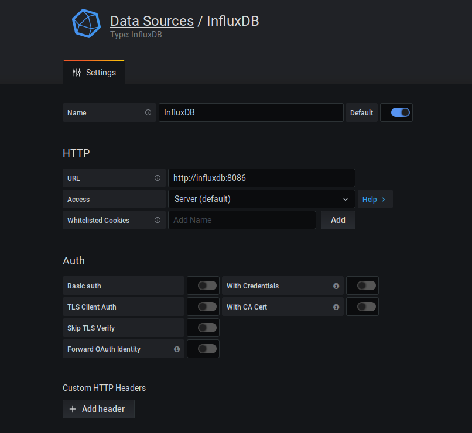
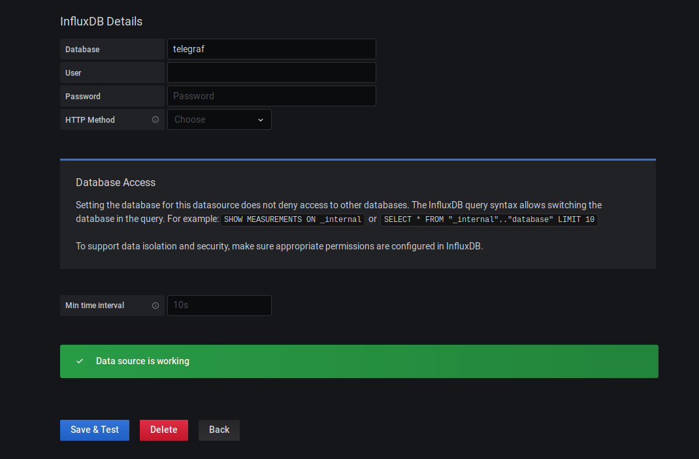

# Monitoring Docker Containers

Monitorización Docker mediante al stack **Telegraf - influxDB - Grafana**.

### Ejecución

Para arrancar los servicios

`docker-compose up -d`

### Uso

Grafana estará disponible en `localhost:3000` con las credenciales `admin // admin`. Dashboards y *datasources* se incluyen directamente en el contenedor.

- Configuración *datasource*

Para acceder a la base de datos Influx

~~~
$ docker exec -it influxdb sh
# influx
Connected to http://localhost:8086 version 1.8.0
InfluxDB shell version: 1.8.0
> show databases
name: databases
name
----
telegraf
_internal
> use telegraf
Using database telegraf
> show measurements
name: measurements
name
----
cpu
disk
diskio
docker
docker_container_blkio
docker_container_cpu
docker_container_mem
docker_container_net
docker_container_status
kernel
mem
processes
swap
system
~~~

#### Enlaces de interés

[Docker Dashboard](https://grafana.com/grafana/dashboards/10585)
