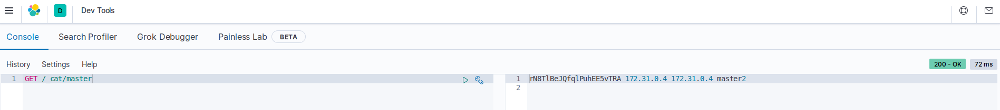
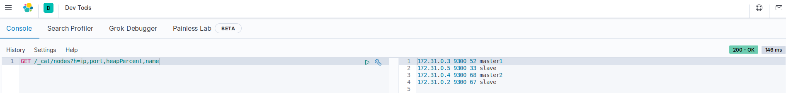

# Elastic Cluster

This repository contains a basic **Elastic** cluster configuration.

### Components

- 2 masters

- 2 slaves

- Kibana

### Pre-requisites

You might need to do following configuration, if your container die after few seconds

~~~
$ sudo sysctl -w vm.max_map_count=262144
~~~

### Doployment

Deploy the cluster with `docker-compose`

~~~
$ docker-compose up -d
~~~

**Config details**

- cluster.name: define the name of the cluster so that every node join to the same cluster.

- node.name: define a name to every node.

- node.data: true if node to store data else false.

- node.master: true if node to behave as a master else false.

- node.ingest: true if node to set as pre-processing documents before indexing else false.

- node.max_local_storage_nodes: very useful for testing failover and different configurations on your development machine.

- transport.tcp.port: transport port is used for internal communication between nodes within the cluster.

- path.data: define the path to store the data.

- path.logs: define the path for the log entry.

- bootstrap.memory_lock: used to lock the process address space into RAM.

- network.host: enter the private IP i.e default is 0.0.0.0

- http.port: enter the port of your node i.e 9200.

- discovery.seed_hosts: enter all the ip address of the nodes.

- cluster.initial_master_nodes: define ((N/2)+1) number of nodes to be elected as master at the beginning to avoid [split brain problem](https://qbox.io/blog/split-brain-problem-elasticsearch).

It is possible set up this configuration (even other options) with a `elasticsearch.yml` mounted on the containers

~~~
volumes:
  - ./elasticsearch/config/elasticsearch.yml:/usr/share/elasticsearch/config/elasticsearch.yml
~~~

### Usage

Check the status of your cluster with the following commands

~~~
$ curl "http://localhost:9200/_cat/nodes?v&pretty"
ip         heap.percent ram.percent cpu load_1m load_5m load_15m node.role master name
172.31.0.3           32          91  62    7.50    3.65     1.84 ilmr      -      master1
172.31.0.5           50          91  62    7.50    3.65     1.84 dilrt     -      slave
172.31.0.4           65          91  62    7.50    3.65     1.84 ilmr      *      master2
172.31.0.2           36          91  62    7.50    3.65     1.84 dilrt     -      slave

$ curl http://localhost:9200/_cat/health
$ curl http://localhost:9200/_cluster/health?pretty
$ curl http://localhost:9200/_cluster/state?pretty
~~~

For *Kibana*

~~~
$ curl http://localhost:5601/api/status
~~~

At least, you can access *Kibana* on `localhost:5601` and make some queries with the **DevTools API**

---

---

### References

[Elastic Docker](https://www.elastic.co/guide/en/elasticsearch/reference/current/docker.html)

[Elastic REST API](https://www.elastic.co/guide/en/elasticsearch/reference/current/rest-apis.html)

[Cluster example](https://medium.com/@jitendrashah1015/elasticsearch-es-cluster-setup-with-high-availability-and-rbac-enabled-kibana-b5f4e54c4631)
