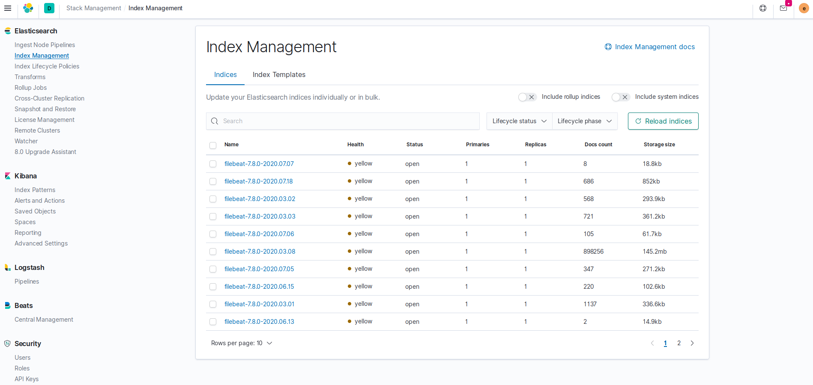
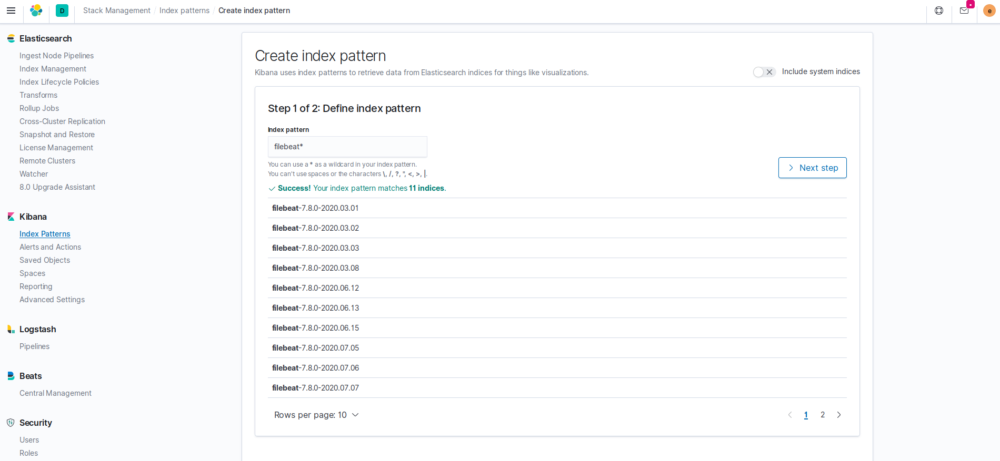
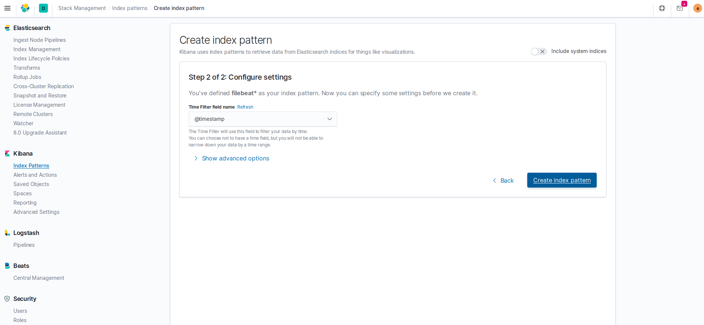
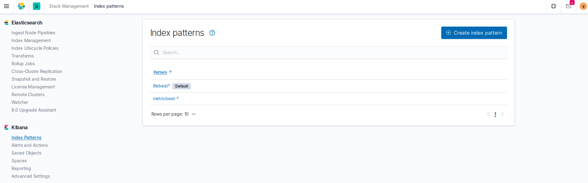
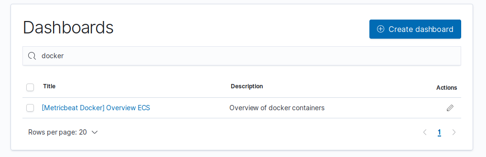
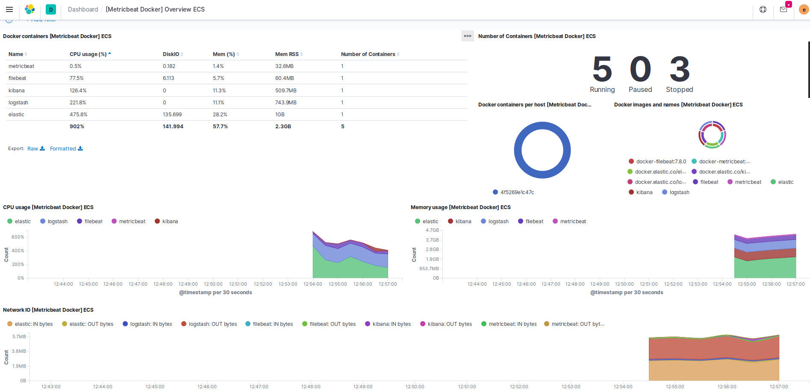

# Stack ELK

Configuración Docker para el conjunto **Elastic - Logstash - Kibana**. Incluye también un *compose* para **Filebeat** y **Metricbeat**.

La configuración propuesta monitoriza el directorio Docker. Por un lado, Filebeat recoge los logs de nuestros contenedores, y por otro Metricbeat monitoriza su estado. El flujo de datos sería el siguiente:

~~
Docker-logs -> Filebeat -> Logstash -> Elastic <-> Kibana

Docker-stasts -> Metricbeat -> Elastic <-> Kibana
~~~

Si se desea dar otro uso entocnes habría que añadir/cambiar los archivos de configuración de cada servicio así como el *compose* correspondiente. En el apartado **Enlaces de interés** se aportan enlaces a la guía de Filebeat y Metricbeat donde podemos ver otros inputs, módulos, etc.

### Ejecuación

Para arrancar los servicios ELK

`docker-compose up -d`

- **Filebeat**

`docker-compose -f docker-compose-filebeat.yml up -d`

O bien todo a la vez (ELK + Filebeat)

`docker-compose -f docker-compose.yml -f docker-compose-filebeat.yml up -d`

- **Metricbeat**. Necesario esperar al menos 60s para que Kibana esté disponible, de lo contrario no se iniciará. Una posible mejora sería configurar un entrypoint que permita controlar la ejecución. Más info en el siguiente [enlace](https://docs.docker.com/compose/startup-order/)

`docker-compose -f docker-compose-metricbeat.yml up -d`

### Uso

Podemos comprobar los *índices* disponibles con el siguiente comando. Las credenciales de acceso se encuentran en los archivos de configuración. Por defecto hemos puesto `elastic // changeme`

`curl 'localhost:9200/_cat/indices?v' -u elastic:changeme`

---

---

### Visualización. Kibana

Kibana estará accesible en `localhost:5601`.

- **Filebeat**. Debemos configurar los *índices* antes de poder visualizarlos en Kibana. Para ello nos dirigimos a *Stack Management* y luego a *Index Patterns*. Seleccionamos la opción *Create index pattern*

---

---

- **Metricbeat**. La configuración del *índice* es automática una vez arrancado el servicio

---

---

Podemos seleccionar un *dashboard* pre-configurado para visualizar las estadísticas de nuestros contenedores (activado en la configuración de Metricbeat)

---

---

#### Enlaces de interés

[Elastic](https://www.elastic.co/guide/en/elasticsearch/reference/current/docker.html)

[Logstash](https://www.elastic.co/guide/en/logstash/current/docker.html)

[Kibana](https://www.elastic.co/guide/en/kibana/current/docker.html)

[Filebeat](https://www.elastic.co/guide/en/beats/filebeat/current/running-on-docker.html)

[Filebeat Inputs](https://www.elastic.co/guide/en/beats/filebeat/current/filebeat-input-docker.html)

[Metricbeat](https://www.elastic.co/guide/en/beats/metricbeat/current/running-on-docker.html)

[Metricbeat Modules](https://www.elastic.co/guide/en/beats/metricbeat/current/metricbeat-modules.html)
