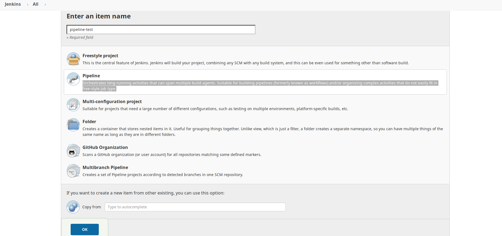
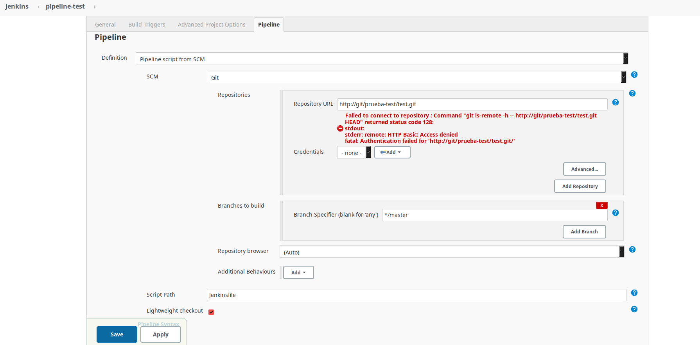

# CI/CD Jenkins - Gitlab - Docker Registry

Configuración Docker para despliegue de servidor **Gitlab** y **Jenkins**.

## Ejecución

Para iniciar los servicios ejecutamos `docker-compose up -d`.

- **Gitlab** disponible en `localhost:80`. Accedemos con usuario `root`.

- **Jenkins** disponible en `localhost:8080`. Credenciales `admin / admin`.

Podemos desplegar una imagen de Jenkins que contiene **Ansible** y **Docker** instalado

`docker-compose -f docker-compose-jenkins.yml up -d`

## CI/CD

La configuración típica para CI/CD es la siguiente:

1. Crear repositorio en Gitlab.

2. Crear job pipeline Jenkins. Necesario url del repositorio y credenciales de acceso. En la url modificamos el dominio tal como lo hemos definido en el *docker-compose.yml* (por defecto *git*).

---





---

3. Agregar script **post-receive** en la ruta del repositorio en el contenedor Gitlab. Este script será el encargado de gatillar el job de Jenkins cada vez que hagamos un *push* al repositorio Gitlab.

```sh
$ docker cp scripts/post_receive git-server:/var/opt/gitlab/git-data/repositories/<group>/<project>.git
$ docker exec -it git-server bash
cd /var/opt/gitlab/git-data/repositories/<group>/<project>.git
mkdir custom_hooks
cp post_receive custom_hooks
chmod +x custom_hooks/post_receive
chown -R git:git custom_hooks
```

Además, debemos modificar el script para incluir las credenciales de acceso y la url del job de Jenkins (previamente creado).

```sh
JENKINS_USER=user
JENKINS_PASSWORD=changeme
JENKINS_PROJECT=http://localhost:8080/job/test/build?delay=0sec
```

4. Crear **Jenkinsfile** en nuestro repositorio. Este archivo contendrá los pasos y scripts que ejecutará el job de Jenkins automáticamente al recibir la señal del script **post-receive**. Una vez ejecutado el job podemos ver los archivos correspondientes en la ruta `~/workspace` dentro del contenedor Jenkins. Se incorporan varios ejemplos en la carpeta `pipeline-examples` para configurar jobs Jenkins tipo *script pipeline* o tipo *Jenkinsfile*.

### Docker Registry

Podemos crear un **Docker Registry** para guardar aquellas imágenes docker construidas a partir de un job Jenkins. Para ello podemos usar la imagen Jenkins que contiene *Docker* instalado. De esta manera podemos automatizar tareas de push/pull sobre este docker registry y además usar contenedores **slave** definidos en nuestro papeline de Jenkins.

`docker-compose -f docker-compose-registry.yml up -d`

Para guardar nuestras imágenes en el docker registry

```sh
$ docker pull hello-world
$ docker image tag hello-world localhost:5000/hello-world
$ docker push localhost:5000/hello-world
$ docker pull localhost:5000/hello-world
```

## Extra

### DOCKER + JENKINS + CENTOS

```sh
$ docker pull jenkins/jenkins
$ docker network create --driver bridge jenkins-net
$ docker run --network=jenkins-net -d -p 8080:8080 --name jenkins jenkins/jenkins

$ wget http://localhost:8080

$ docker logs <containerID> 		# Contraseña acceso jenkins
$ docker exec -it jenkins bash		# Contraseña acceso jenkins en la ruta que indica
```

Ejecutar jobs mediante curl. Debemos activar el *CSRF Protection* y generar el token antes de lanzar el curl.

token=$(curl -u "<user>:<password>" -s 'http://localhost:8080/crumbIssuer/api/xml?xpath=concat(//crumbRequestField,":",//crumb)')
$ curl -u "<user>:<password>" -H "$token" -X POST http://localhost:8080/job/<job_name>/build?delay=0sec	# Ejecuta inmediatamente
$ curl -u "<user>:<password>" -H "$token" -X POST http://localhost:8080/job/<job_name>/buildWithParameters?<PARAMETER>=<value>&<PARAMETER2>=<value2>

**Plugin útiles para Jenkins**: SSH, Role-based Authorization Strategy

Centos7 conectado a la misma red que Jenkins `$ docker pull centos/centos:centos7`. Si queremos desde *Dockerfile*

```sh
$ mkdir ~/Centos7
$ ssh-keygen -t rsa -b 4096		# Generamos key ssh
$ docker build -t <user>/centos7 .	# Desde Dockerfile

FROM centos:centos7
RUN yum -y update && \
    yum -y install openssh-server
RUN useradd <user> && \
    echo "1234" | passwd <user> --stdin && \
    mkdir /home/<user>/.ssh && \
    chmod 700 /home/<user>/.ssh
COPY id_rsa_centos.pub /home/<user>/.ssh/authorized_keys
RUN chown <user>:<group> -R /home/<user> && \
    chmod 600 /home/<user>/.ssh/authorized_keys
RUN /usr/sbin/sshd-keygen > /dev/null 2>&1
CMD /usr/sbin/sshd -D
```

Arrancamos imagen centos desde Dockerfile conectado a la red de jenkins `$ docker run --network=jenkins-net -d --name <container_name> <user>/centos7`

Comprobamos la conexión Jenkins-Centos

```sh
$ docker cp ~/Centos7/id_rsa_centos jenkins:/tmp # Conexión ssh en archivo temporal
$ docker exec -it jenkins bash
ping <container_name>
cd /tmp
ssh <user>@<container_name> # Password definida en el Dockerfile (1234)
```


## Enlaces de interés

[Gitlab Docker](https://docs.gitlab.com/omnibus/docker/)

[Jenkins Docker](https://github.com/jenkinsci/docker/blob/master/README.md)

[Jenkins Pipeline](https://www.jenkins.io/doc/book/pipeline/)

[Docker Registry](https://docs.docker.com/registry/)
