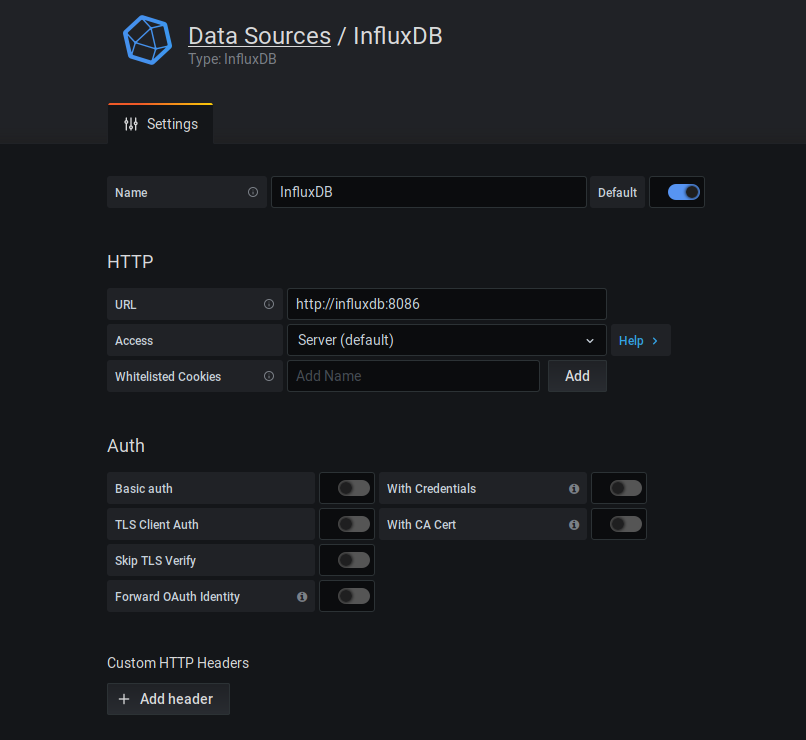
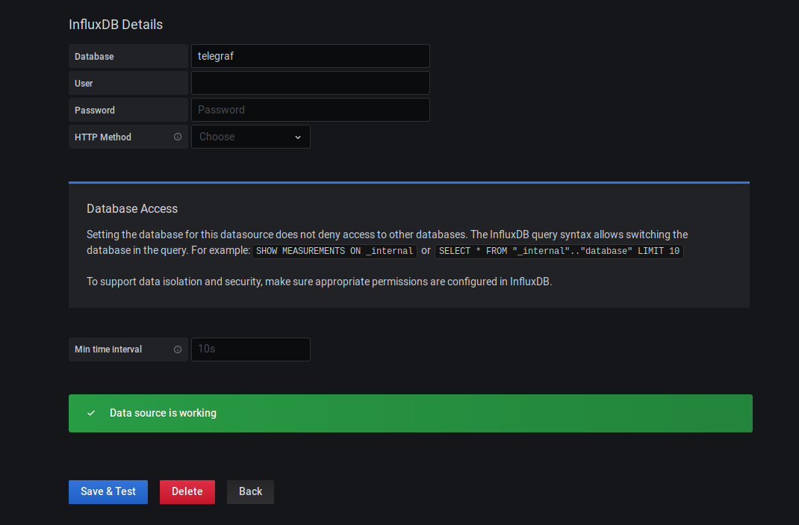

# Monitoring Docker Containers

Monitorización Docker mediante al stack **Telegraf - influxDB - Grafana**.

### Ejecución

Para arrancar los servicios

`docker-compose up -d`

### Uso

Accedemos a `http://localhost:3000` con las credenciales `admin // admin`. Dashboards y *datasource* se incluyen directamente en el contenedor grafana.

- Configuración *datasource*

#### Enlaces de interés

[Docker Dashboard](https://grafana.com/grafana/dashboards/10585)
